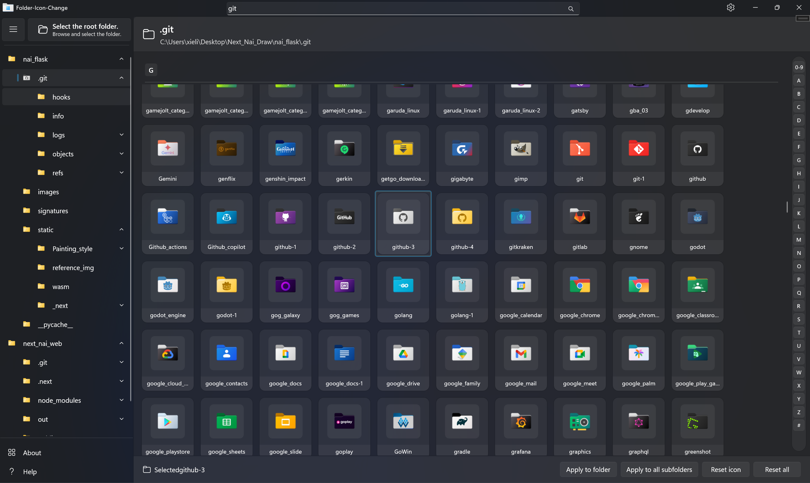

# ChangeFolderIcon - Folder Icon Customization Tool  

[ChangeFolderIcon](https://github.com/YILING0013/ChangeFolderIcon) is a Windows folder icon customization tool developed using **WinUI3** and **Windows API**. It allows quick icon modification via drag-and-drop, supports batch icon updates for nested folders, and provides predefined icon styles for easy application.  

[中文版本](README.md)

---  

### Preview:  

  

## Build from Source  

#### Development Requirements  

* **Visual Studio 2022** (Version 17.0 or later)  
* **.NET Desktop Development** workload  
* **Windows App SDK** development tools  

#### Build Steps  

- [ ] Install **Visual Studio 2022** with **.NET Desktop Development** and **WinUI App Development** workloads.  
- [ ] Clone the repository: `git clone https://github.com/YILING0013/ChangeFolderIcon.git` 
- [ ] Open `ChangeFolderIcon.sln` inside the `ChangeFolderIcon` folder.  
- [ ] In **Visual Studio**, right-click the solution → **Restore NuGet Packages**.  
- [ ] Press `Ctrl+Shift+B` or go to **Build** → **Build Solution**.  
- [ ] Press `F5` to debug or `Ctrl+F5` to run without debugging.  

### Notes  
- Requires **Windows 10 or later**.  
- On first launch, go to **Settings** and wait for icon resources to load, then restart the app.  
- To change the language, select a language in **Settings** and restart the app.  

## License  

This project is open-source under the [GNU License](LICENSE).  

---  
⭐ If you find this project useful, please give it a **Star**! 🚀