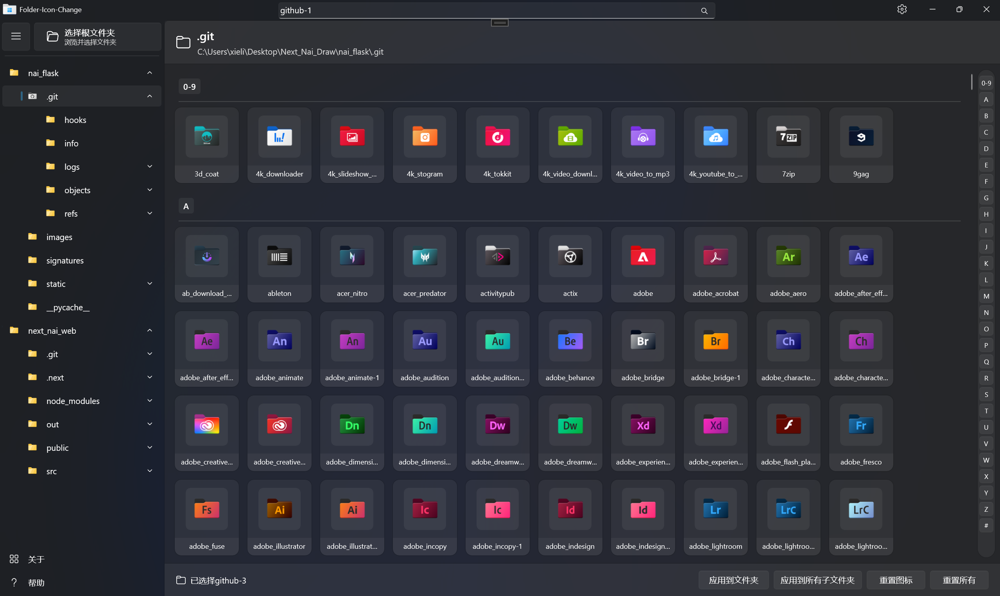

# ChangeFolderIcon 文件夹图标修改程序

[ChangeFolderIcon](https://github.com/YILING0013/ChangeFolderIcon)是基于WinUI3以及Windows API开发的一款对Windows文件夹图标快速修改程序，支持拖入文件夹快速应用图标样式，以及创建文件夹层级目录，快捷变更每一层文件夹的图标样式。

[English Version](README-EN-US.md)

---

### 预览图:

## 从源码构建

#### 开发环境要求

* **Visual Studio 2022** (17.0 或更高版本)
* **.NET 桌面开发** 工作负载
* **Windows 应用 SDK** 开发工具

#### 构建步骤

- [ ] 安装**Visual Studio 2022**，安装 .Net桌面开发以及WinUI 应用程序开发
- [ ] 克隆项目到本地：`get clone https://github.com/YILING0013/ChangeFolderIcon.git`
- [ ] 打开`ChangeFolderIcon`文件夹内的`ChangeFolderIcon.sln`
- [ ] 在` Visual Studio` 中右键解决方案 → 还原 `NuGet` 包
- [ ] 按 `Ctrl+Shift+B` 或菜单栏 **生成** → **生成解决方案**
- [ ] 按 `F5` 启动调试，或 `Ctrl+F5` 无调试启动

### 注意事项
- 确保您的系统为 Windows 10 或更高版本。
- 初次运行请点击设置页，等待图标资源加载完成后点击检查更新。
- 如果无法正常拉取图标资源，请检查网络连接或手动下载图标资源包，并在设置页中选择本地图标资源包。
- 切换语言请在设置页中选择语言后重启程序。

## 许可证

本项目采用 [GNU 许可证](LICENSE) 开源。

---

### 致谢

本项目部分图标资源来源于 [Folder-Ico](https://github.com/icon11-community/Folder-Ico)，特此感谢该项目的贡献者。  

---  

⭐ 如果这个项目对您有帮助，请给我一个 Star！🚀
